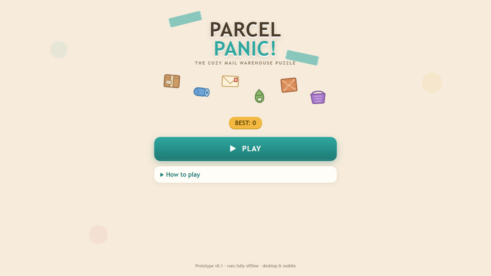
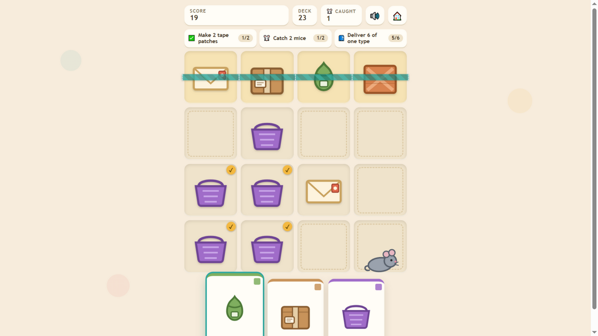
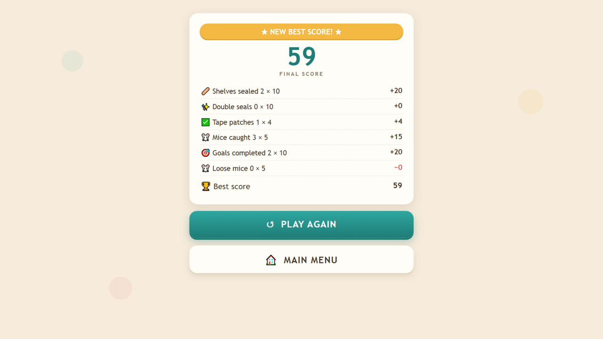
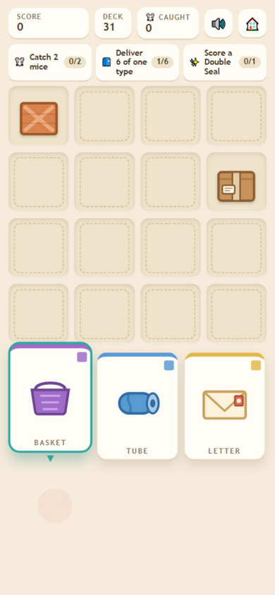

# Parcel Panic! 📦🐭

**The cozy mail warehouse puzzle.** Sort parcels onto the shelves, seal full rows with tape, patch together matching crates — and watch out for the mice that chew your parcels!

An original HTML5 casual puzzle prototype, built as a single self-contained file with zero dependencies. Desktop & mobile (mouse + touch), fully offline-capable.

| | |
|---|---|
|  |  |
|  |  |

## Run it

No build, no install:

- **Just open** `parcel-panic.html` in any modern browser, or
- serve the folder (`python -m http.server`, `npx http-server`, anything) and open the page.

## How to play

A shift lasts **16 delivered parcels**. On each turn, tap a parcel card in your hand, then tap a shelf slot.

- 🩹 **Seal a shelf** — fill a full row or column with **4 different** parcels: **+10**
- ✅ **Tape patch** — a 2×2 block of one parcel type: **+4**
- 🐭 **Catch a mouse** — deliver a parcel onto it: **+5**
- ✨ **Double seal** — a single parcel completes both a row and a column: **+10** bonus
- 🎯 **Goals** — 3 goal cards per shift, **+10** each
- 🐭 **Loose mice** — any mouse left uncaught at the end: **−5**. A mouse left alone for 3 turns gets hungry and **chews a neighbouring parcel** (sealed shelves and patches are safe)

Chase the high score — it is saved locally.

## Tech notes

- Single `parcel-panic.html` file (~30 KB): vanilla JS + hand-drawn inline SVG art
- WebAudio-synthesised sound effects, no audio assets
- No network requests, no external fonts/libraries/trackers
- Responsive layout, tested down to 390 px width

## Roadmap

- [ ] CrazyGames SDK v3 integration (ads, happytime events)
- [ ] Final name / trademark check before portal submission
- [ ] Polish: confetti on new best, settings screen, more goal variety
- [ ] Balance tuning based on playtest scores

## License

All rights reserved by the repository owner (game is being prepared for portal distribution).
